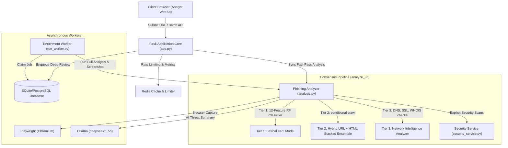

# System Architecture Design Document (HLD & LLD)

This document provides a comprehensive blueprint of the **PhishScope / PhishIntel** threat intelligence and phishing detection platform. It contains both a High-Level Design (HLD) showing the architectural dataflow, and a Low-Level Design (LLD) with exact function signatures, descriptions, and class mechanics.

---

# Part 1: High-Level Design (HLD)

## 1. System Context & Overview
PhishScope is an enterprise-grade threat intelligence engine that analyzes submitted URLs for phishing signatures using a multi-tiered consensus pipeline. It functions as a secure analyst workstation utilizing client-side security audits, DNS/SSL analytics, inline JavaScript de-obfuscation scanners, and machine learning models.



---

## 2. The 3-Tier Layered Consensus Architecture
To protect against feature leakage (such as transport status variables) while ensuring robustness, the model architecture is segmented into three distinct evaluation layers:

| Layer | Component | Method | Input Parameters | Performance Characteristics |
| :--- | :--- | :--- | :--- | :--- |
| **Tier 1** | **Lexical URL Classifier** | RandomForestClassifier | URL string features only (length, slash count, phish hints, dots, www, hyphens, digit ratio, word metrics). | **Always Available**. Fast execution with 89.89% Accuracy and 90.57% F1-score. |
| **Tier 2** | **Hybrid URL + HTML Ensemble** | StackingClassifier | URL lexical structures + crawled webpage HTML features (iframe count, login forms, null links). | **Conditional**. Executed only if crawling succeeds. Returns ~94.4% Accuracy. |
| **Tier 3** | **Network Intelligence** | DNS, SSL, WHOIS checks | Domain name + Client connection data. | Evaluates DNS A/MX/SPF/DMARC health, SSL validity, and domain age reputation. |

### Consensus Scoring Weights
Final scores (`hybrid_score`) are computed dynamically based on crawler outcome:
* **HTML Fetch Success (Crawled)**:
  $$\text{Score} = 0.55 \cdot \text{Tier 1} + 0.25 \cdot \text{Tier 2} + 0.10 \cdot \text{Tier 3} + 0.10 \cdot \text{Security Layer}$$
* **HTML Fetch Failure (Offline)**:
  $$\text{Score} = 0.75 \cdot \text{Tier 1} + 0.15 \cdot \text{Tier 3} + 0.10 \cdot \text{Security Layer}$$

---

## 3. Database Schema Design (storage.py)
The database stores structured configuration records, logs, background tasks, and reviews across five core tables:

1. **`users`**: Contains credential hashes for local platform authentication (username, first name, last name, mobile number, password hash).
2. **`analysis_history`**: Saves the full serialized JSON payload of every URL analyzed (input URL, normalized URL, verdict, final score, ML probability, cache flags, timestamp).
3. **`analysis_notes`**: Stores custom plain-text security notes linked to individual analysis logs.
4. **`analysis_feedback`**: Aggregates manual helpful/needs-review indicators and corrected threat labels.
5. **`background_jobs`**: Implements a durable task-queue locking system for asynchronous worker threads (`pending`, `running`, `completed`, `failed`).

---

# Part 2: Low-Level Design (LLD)

## 1. Class & Method Specifications

### 1.1 `SecurityService` (`flask_phishing_app/services/security_service.py`)
Provides dedicated client-side header security validation and JavaScript pattern scanning.

* **`check_obfuscation(self, html_content: str) -> tuple[bool, list[str]]`**
  * *Description*: Uses regular expressions to scan script blocks for dangerous dynamic code hooks, hex-encoded character blocks, or base64 inline sequences.
  * *Arguments*: `html_content` (str)
  * *Returns*: `(is_obfuscated: bool, findings: list[str])`
* **`analyze(self, headers: dict, html_content: str, redirect_count: int) -> dict`**
  * *Description*: Computes a security risk score out of 100 based on header presence and inline audits.
  * *Arguments*: `headers` (dict), `html_content` (str), `redirect_count` (int)
  * *Returns*: A dict containing `security_score`, `csp_present`, `hsts_present`, `x_frame_options_present`, `has_iframe`, `js_obfuscated`, `redirect_count`, and `security_findings` (list of strings).

---

### 1.2 `PhishingAnalyzer` (`flask_phishing_app/services/analysis.py`)
The orchestrator of model evaluations, network enrichment, chart plotting, and document reporting.

* **`__init__(self, BASE_DIR: Path, model_dir: Path) -> None`**
  * *Description*: Instantiates paths, sets up matplotlib environment variables, loads local model binaries synchronously, and imports the Tier 3 module.
* **`_load_artifacts(self) -> ModelArtifacts`**
  * *Description*: Loads pickles from `Model/1/` and `Model/2/` synchronously. Instantiates Tier 3 dynamic modules. Raises file errors immediately if files are missing.
* **`_extract_tier1_features(self, url: str) -> dict[str, float]`**
  * *Description*: Analyzes URL string formats to compute 12 lexical parameters.
* **`_run_tier1_model(self, features: dict[str, float]) -> dict[str, Any]`**
  * *Description*: Preprocesses URL features and runs inference against the RandomForest model.
* **`analyze_url(self, raw_url: str) -> dict[str, Any]`**
  * *Description*: Runs complete synchronous 3-Tier analysis (crawling, SSL check, reputation check, threat intel search, SHAP calculation, screenshot, charts generation, and Ollama review).
* **`analyze_url_fast(self, raw_url: str) -> dict[str, Any]`**
  * *Description*: Runs URL features (Tier 1) and quick crawls instantly, then queues deep details (Ollama, screenshots, WHOIS checks) to the background queue.
* **`_build_chart_assets(self, scores: dict, shap_result: dict, final_score: float) -> dict`**
  * *Description*: Generates base64 PNG images for the Risk Gauge, Component Breakdown, and SHAP features.
* **`generate_pdf_report(self, data: dict) -> Path`**
  * *Description*: Generates a clean PDF summary containing system results, findings, and diagrams.

---

### 1.3 `HistoryStore` (`flask_phishing_app/services/storage.py`)
Abstracts database connection and operations for PostgreSQL and SQLite.

* **`save(self, result: dict, username: str | None, auth_provider: str | None) -> int`**
  * *Description*: Saves the full analysis JSON payload and returns the auto-increment ID.
* **`claim_job(self, worker_id: str, stale_after_seconds: int) -> dict | None`**
  * *Description*: Selects, claims, and marks a pending background job using row locks (`FOR UPDATE SKIP LOCKED` for PG, database-wide commits for SQLite).
* **`complete_job(self, job_id: int) -> None`**
  * *Description*: Updates job status to `completed`.
* **`fail_job(self, job_id: int, error: str, retryable: bool) -> None`**
  * *Description*: Updates job status to `failed` or `retry` with backoff intervals.

---

### 1.4 `EnrichmentQueue` (`flask_phishing_app/enrichment_queue.py`)
A durable background worker managing concurrent asynchronous analysis tasks.

* **`start(self) -> None`**
  * *Description*: Spawns a daemon execution thread targetting the run loop.
* **`_run(self) -> None`**
  * *Description*: Infinite loop polling `HistoryStore.claim_job` at regular intervals.
* **`_process_job(self, job: dict) -> None`**
  * *Description*: Resolves the analysis ID, triggers the deep `PhishingAnalyzer.analyze_url`, and writes the completed JSON back to the database history table.

---

## 2. API Endpoints Map (`flask_phishing_app/app.py`)

| Endpoint | Method | Authentication | Rate Limiting | Description |
| :--- | :--- | :--- | :--- | :--- |
| `/` | `GET` | None | None | Redirects to login page. |
| `/login` | `GET` | None | None | Renders login page interface. |
| `/dashboard` | `GET` | Required | None | Serves main workstation workspace. |
| `/api/auth/login` | `POST` | None | Login Limit | Authenticates username/password. |
| `/api/auth/register` | `POST` | None | Login Limit | Registers local user accounts. |
| `/api/auth/google` | `POST` | None | Login Limit | Authenticates using Google ID token credentials. |
| `/api/analyze` | `POST` | Required | Analysis Limit | Triggers fast analysis and queues background jobs. |
| `/api/batch` | `POST` | Required | Batch Limit | Accepts array of URLs for concurrent evaluations. |
| `/api/analysis/<id>` | `GET` | Required | None | Returns the full analysis record by primary ID. |
| `/api/analysis/<id>/notes` | `POST` | Required | Notes Limit | Appends analyst notes to the log. |
| `/api/analysis/<id>/feedback` | `POST` | Required | Notes Limit | Appends manual helpfulness logs and corrected labels. |
| `/api/report/<id>` | `GET` | Required | None | Generates and downloads the PDF report file. |
| `/api/health` | `GET` | Required | None | Returns connection states of Redis, DB, and system models. |

---

## 3. UI Controller Data Bindings (`flask_phishing_app/static/app.js`)

The front-end is written in vanilla ES6 Javascript utilizing state machine binds to capture DOM nodes and map response streams dynamically:

* **`renderResult(data)`**:
  * Clears results view layout states.
  * Extrapolates scores using `modelScoreValue` and `finalLikelihoodValue`.
  * Injects HTML strings displaying findings, component scores, and the **Explicit Security Service findings**.
  * Binds image attributes directly to base64 images generated by the backend:
    ```javascript
    setChart(chartGauge, data.charts?.gauge);
    setChart(chartComponents, data.charts?.components);
    setChart(chartShap, data.charts?.shap);
    ```
* **`pollEnrichment(analysisId)`**:
  * Triggers a 3-second polling interval querying `/api/analysis/<id>` until `enrichment.status` changes from `"pending"` to `"complete"`, updating UI charts and screens dynamically as data streams in.
* **`extractUrlsFromText(text)`**:
  * Regular expression extractor normalization handling defanged HTTP patterns (`hxxps://` or `hxxp://`) and list items automatically.
